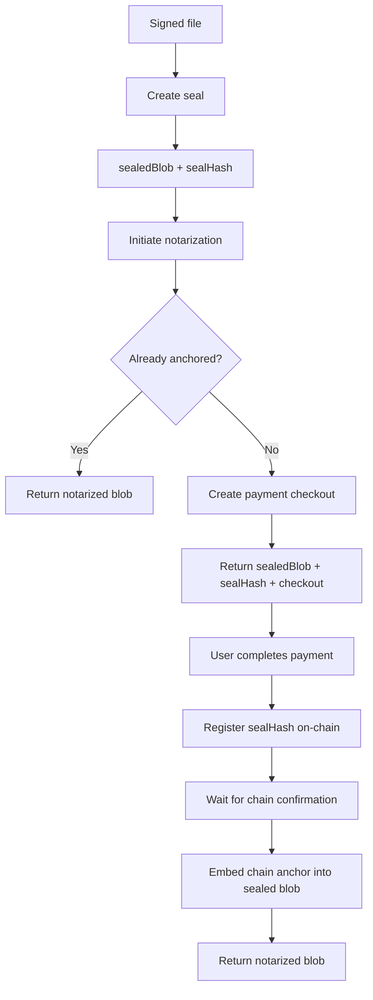

# Majikah SDK

[](https://majikah.solutions)

[](https://www.npmjs.com/package/@majikah/sdk) [](https://www.npmjs.com/package/@majikah/sdk)
[](https://opensource.org/licenses/Apache-2.0) [](https://www.typescriptlang.org/) [](https://www.iana.org/assignments/media-types/application/vnd.majikah.mjksig)


The official TypeScript SDK for the **Majikah ecosystem**.

`@majikah/sdk` provides a unified developer interface for Majikah's public services:

* **Majik Universal ID (MUID)** — public identity lookup and signature verification
* **Time Stamping Authority (TSA)** — trusted timestamps for digital signatures
* **Signed Links (SLink)** — signed claims associated with URLs and content hashes
* **File Notarization** — payment-aware on-chain anchoring of sealed files

The SDK is designed to work with Majikah's local cryptographic libraries, including `@majikah/majik-key`, `@majikah/majik-signature`, and `@majikah/majik-slink`.

Cryptographic operations that require private keys are performed locally. Private signing keys are not uploaded to the Majikah API by the SDK.

---

## Why the Majikah SDK?

The SDK combines Majikah's public services with local cryptographic operations so applications can build complete signing, verification, timestamping, SLink, and notarization workflows without implementing the API protocol themselves.

For example, a single application can:

```text
Create or receive a signed file
        │
        ├── Verify the signature against a MUID
        │
        ├── Request a trusted timestamp
        │
        ├── Publish or verify a signed URL claim
        │
        └── Seal and notarize the file on-chain
```

The SDK also keeps service-specific functionality separated:

```ts
majikah.muid
majikah.tsa
majikah.slink
majikah.notary
```

This allows you to use only the part of the ecosystem your application actually needs.

---

## Features

### MUID

Verify signatures against public Majik Universal ID identities.

* Look up public MUID profiles
* Retrieve the authenticated MUID
* Verify existing embedded signatures
* Verify detached signature envelopes
* Select a specific signer in multi-signature files
* Verify against a specific MUID by ID or username

### TSA

Request trusted timestamps for digital signatures.

* Issue a TSA timestamp directly from a signature
* Timestamp an already-signed embedded file
* Timestamp a detached signature envelope
* Sign and timestamp a file in one operation
* Check TSA quota
* Automatically reuse the signature's TSA request payload

### SLink

Create, register, search, and cryptographically verify signed link claims.

* Register existing SLinks
* Create, sign, and register an SLink in one operation
* Search claims by URL
* Search claims by content hash
* Retrieve SLinks by ID
* Delete SLinks
* Verify SLink signatures locally
* Resolve public signing keys through MUID or a custom key registry
* Cursor-based pagination for owned SLinks

### File Notarization

Anchor sealed file hashes on-chain through a payment-aware workflow.

* Check or initiate payment for a sealed file
* Return the sealed artifact while payment is pending
* Register a paid seal hash
* Monitor on-chain confirmation
* Poll until a terminal state
* Embed the resulting chain anchor back into the file
* Seal an already-signed file and begin notarization
* Run the complete single-signer `sign → seal → initiate` workflow

---

## Installation

Install the SDK with npm:

```bash
npm install @majikah/sdk
```

The SDK is designed to work with the Majikah cryptographic packages used by the specific workflows in your application.

For example:

```bash
npm install @majikah/sdk @majikah/majik-key @majikah/majik-signature @majikah/majik-slink
```

Use the packages required by your application rather than installing the entire Majikah ecosystem unnecessarily.

---

## Get an API Key

To use the Majikah public API, you first need to create and activate your developer account.

1. Go to [developers.majikah.solutions](https://developers.majikah.solutions/early-access).
2. Complete the developer onboarding process:
   - Create your Majikah account.
   - Create your **Majik Universal ID (MUID)**.
   - Verify your MUID by completing the required **KYC verification**.
   - Submit the **Early Access application** through the developer portal.
3. Wait for your application to be reviewed and approved by the Majikah team.
4. Once approved, you will receive an **email confirmation** and gain access to API key generation in the developer portal.
5. Generate your API key and keep it secure. You will use this key when initializing `MajikahSDKClient`.

> **Early Access:** Public API access is currently subject to developer approval. An API key cannot be generated until your Early Access application has been approved.


---

## Requirements

The SDK expects a modern JavaScript runtime with:

* `fetch`
* `URL`
* `AbortController`
* `atob` / `btoa`

These APIs are available natively in modern browsers and current Node.js, Deno, Bun, and edge runtimes.

A custom `fetch` implementation can also be supplied through the client options when integrating with a specialized runtime or transport layer.

---

## Authentication

Create a `MajikahSDKClient` with your public API key:

```ts
import { MajikahSDKClient } from "@majikah/sdk";

const majikah = new MajikahSDKClient({
  apiKey: process.env.MAJIKAH_API_KEY!,
});
```

The SDK automatically sends the API key using the expected authentication header.

Do not hard-code API keys into browser source code or commit them to your repository.

For server-side applications, use environment variables or another secure secret-management mechanism.

---

## Client Configuration

The client supports a number of optional transport and API settings.

```ts
const majikah = new MajikahSDKClient({
  apiKey: process.env.MAJIKAH_API_KEY!,

  baseUrl: "https://api-public.majikah.solutions",

  version: 1,

  timeoutMs: 15_000,

  headers: {
    "X-Custom-Header": "example",
  },

  retry: {
    maxAttempts: 3,
    initialDelayMs: 300,
    jitterFactor: 0.4,
    capDelayMs: 5_000,
  },
});
```


### Configuration options

| Option      | Description                                 | Default                                |
| ----------- | ------------------------------------------- | -------------------------------------- |
| `apiKey`    | API key used to authenticate requests       | Required                               |
| `baseUrl`   | Public Majikah API base URL                 | `https://api-public.majikah.solutions` |
| `version`   | Global API version or per-service versions  | `1`                                    |
| `timeoutMs` | Request timeout in milliseconds             | `15000`                                |
| `headers`   | Additional request headers                  | `{}`                                   |
| `fetch`     | Custom `fetch` implementation               | Runtime `fetch`                        |
| `retry`     | Retry configuration for retry-safe requests | See below                              |

### Per-service API versions

A single version can be applied to every service:

```ts
const majikah = new MajikahSDKClient({
  apiKey,
  version: 1,
});
```

Individual services can also be versioned independently:

```ts
const majikah = new MajikahSDKClient({
  apiKey,
  version: {
    tsa: 1,
    notary: 1,
    slink: 1,
    muid: 2,
  },
});
```

Services not explicitly overridden inherit the fallback version.

---

## Standalone Service Clients & Tree-Shaking

If your application only requires a specific Majikah service rather than the full ecosystem, you can instantiate any service client directly using its static `init` method. 

This approach automatically provisions the underlying `HttpClient` using the supplied configuration, allowing you to bypass the root `MajikahSDKClient` and safely tree-shake unused service logic and heavy cryptographic dependencies from your production bundle.

### TSA Client Standalone

```ts
import { TSAClient } from "@majikah/sdk/tsa";

const tsa = TSAClient.init({
  apiKey: process.env.MAJIKAH_API_KEY!,
  timeoutMs: 15_000,
});

const quota = await tsa.quota();
```

### Notary Client Standalone

```ts
import { NotaryClient } from "@majikah/sdk/notary";

const notary = NotaryClient.init({
  apiKey: process.env.MAJIKAH_API_KEY!,
});

const anchor = await notary.status("anchor-123");
```

### SLink Client Standalone

```ts
import { SLinkClient } from "@majikah/sdk/slink";

const slink = SLinkClient.init({
  apiKey: process.env.MAJIKAH_API_KEY!,
});

const results = await slink.verifyUrl("example.com");
```

### MUID Client Standalone

```ts
import { MUIDClient } from "@majikah/sdk/muid";

const muidClient = MUIDClient.init({
  apiKey: process.env.MAJIKAH_API_KEY!,
});

const profile = await muidClient.lookup("alice");
```


---

## Retry behavior

The SDK automatically retries retry-safe requests using exponential backoff with jitter.

`GET` requests are retryable by default.

`POST` requests are only retried when explicitly marked as idempotent internally.

This distinction prevents the SDK from accidentally repeating operations that could create duplicate side effects.

Default retry settings:

```ts
{
  maxAttempts: 3,
  initialDelayMs: 300,
  jitterFactor: 0.4,
  capDelayMs: 5_000,
}
```

Rate-limit responses can also provide retry timing information that the SDK uses when mapping the API response.

---

# Service Modules

## 1. MUID — Identity and Signature Verification

MUID provides public identity information and lets applications verify digital signatures against a MUID.

### Look up a MUID

```ts
const profile = await majikah.muid.lookup("alice");

console.log(profile);
```

The lookup accepts either a MUID identifier or username.

### Get the current MUID

```ts
const me = await majikah.muid.me();

console.log(me);
```

### Verify an existing signed file

```ts
const result = await majikah.muid.verifyFile(signedFile, {
  muid: "alice",
});

if (result.valid) {
  console.log("Signature is valid.");
}
```

When the file contains multiple signatures, identify which signer should be verified:

```ts
const result = await majikah.muid.verifyFile(signedFile, {
  expectedSignerId: signerFingerprint,
  muid: "alice",
});
```

When `muid` is omitted, verification uses the MUID associated with the caller's API credentials where supported by the API.

### Verify a detached envelope

```ts
const result = await majikah.muid.verifyFileDetached(envelope, {
  muid: "alice",
});
```

Detached verification operates on the signature envelope rather than an embedded signature inside the original file.

---

## 2. TSA — Trusted Timestamping

The TSA service provides trusted timestamps for Majik Signatures.

### Timestamp an existing signature

For a file that has already been signed:

```ts
const { blob, signature } = await majikah.tsa.timestampFile(
  signedFile,
);
```

No `MajikKey` is required for this operation because the method does not create a new signature.

For a multi-signature file:

```ts
const { blob, signature } = await majikah.tsa.timestampFile(
  signedFile,
  {
    expectedSignerId: signerFingerprint,
  },
);
```

### Timestamp a detached envelope

```ts
const { envelope, mjksig } =
  await majikah.tsa.timestampDetached(envelope);
```

The returned `mjksig` is the serialized detached signature envelope.

### Sign and timestamp in one operation

```ts
const result = await majikah.tsa.stampFile(
  file,
  myUnlockedMajikKey,
  {
    contentType: "application/pdf",
  },
);

console.log(result.blob);
```

This performs:

```text
sign
  ↓
request TSA timestamp
  ↓
attach TSA
  ↓
embed signature
```

### Sign and return a detached timestamped envelope

```ts
const result = await majikah.tsa.stampFileDetached(
  file,
  myUnlockedMajikKey,
  {
    contentType: "application/pdf",
  },
);

const { envelope, mjksig } = result;
```

This is useful when the signature needs to be distributed separately from the original file.

### TSA quota

```ts
const quota = await majikah.tsa.quota();

console.log(quota);
```

---

## 3. SLink — Signed Link Claims

SLink associates cryptographically signed claims with URLs or content hashes.

A useful distinction is:

> **SLink lookup establishes that a claim exists. Cryptographic verification establishes that the claim's signature is valid.**

The API does not need to store the signer's public keys for local verification.

### Register an existing SLink

```ts
const stored = await majikah.slink.create(slink);
```

A `MajikSLink` instance or serialized JSON can be supplied.

### Create, sign, and register an SLink

```ts
const stored = await majikah.slink.registerUrl(
  "https://example.com",
  aliceKey,
  userId,
  muid,
);
```

A bare domain is also supported by the underlying SLink workflow:

```ts
const stored = await majikah.slink.registerUrl(
  "example.com",
  aliceKey,
  userId,
  muid,
);
```

### Search by URL

```ts
const results = await majikah.slink.verifyUrl(
  "example.com",
);

console.log(results.matches);
```

The SDK automatically normalizes a bare domain to HTTPS before sending the request.

### Search by content hash

```ts
const results = await majikah.slink.verifyByHash(hash);

console.log(results.matches);
```

### Local cryptographic verification

To verify every search result cryptographically, use `verifyUrlWithProof()`.

The simplest MUID-backed approach is:

```ts
import { createMuidPublicKeyResolver } from "@majikah/sdk";

const results = await majikah.slink.verifyUrlWithProof(
  "thezelijah.world",
  createMuidPublicKeyResolver(majikah.muid),
);

const verified = results.filter(({ result }) => result.valid);
```

`createMuidPublicKeyResolver()`:

1. Resolves each MUID through `MUIDClient.lookup()`
2. Reads the public signing keys
3. Converts their Base64 representation to the SDK's binary key format
4. Supplies the keys to the local signature verifier

### Custom public key sources

Applications can supply their own trusted key registry:

```ts
const results = await majikah.slink.verifyUrlWithProof(
  "example.com",
  async (muid, signerId) => {
    const keys = await myKeyRegistry.get(muid);

    return {
      signerId,
      edPublicKey: keys.edPublicKey,
      mlDsaPublicKey: keys.mlDsaPublicKey,
    };
  },
);
```

This makes SLink verification independent of a specific public-key storage backend.

### Verify already-fetched matches

If you already called `verifyUrl()` or `verifyByHash()`, you can verify the returned matches without performing another lookup:

```ts
const search = await majikah.slink.verifyUrl("example.com");

const verified = await majikah.slink.verifyMatches(
  search.matches,
  createMuidPublicKeyResolver(majikah.muid),
);
```

### List your SLinks

SLink ownership listings use cursor-based pagination:

```ts
const page = await majikah.slink.me({
  limit: 50,
});

console.log(page.items);
```

Fetch the next page using the returned opaque cursor:

```ts
if (page.has_more && page.next_cursor) {
  const nextPage = await majikah.slink.me({
    cursor: page.next_cursor,
    limit: 50,
  });
}
```

The cursor should be treated as opaque data. Do not decode or modify it.

---

# 4. Notary — File Notarization

Notary provides payment-aware on-chain anchoring for sealed files.

A notarization is based on the file's **seal hash**, rather than uploading the entire file to the notarization service.

The sealed artifact remains with the application. The Majikah notarization service uses the seal hash to associate payment and on-chain anchoring with that artifact.

Do not re-seal or otherwise modify the artifact before finalization, as the `sealHash` must continue to correspond to the sealed content.

The high-level lifecycle is:




### Start notarization for an already-sealed file

```ts
const result =
  await majikah.notary.initiateNotarization(sealedFile);
```

The result tells you what happens next.


### Payment required

```ts
const result =
  await majikah.notary.initiateNotarization(sealedFile);

if (result.status === "payment_required") {
  console.log(result.sealHash);
  console.log(result.checkout.checkout_url);
  console.log(result.sealedBlob);
}
```

The checkout URL can be presented as a QR code or another payment interface.

The `sealedBlob` returned with the payment-required result is the exact sealed artifact associated with the returned `sealHash`. Retain both values while payment is being completed.

After payment is completed, finalize the notarization using the returned `sealedBlob` and `sealHash`:

```ts
if (result.status === "payment_required") {
  const finalized =
    await majikah.notary.finalizeNotarization(
      result.sealedBlob,
      result.sealHash,
      {
        poll: {
          intervalMs: 2000,
          timeoutMs: 130_000,
        },
      },
    );

  console.log(finalized.anchor.id);
  console.log(finalized.blob);
}
```

The sealed file is not uploaded to the notarization service as part of this flow. The service uses the seal hash to associate the payment and on-chain notarization with the sealed artifact.


### Already anchored

If the file was already notarized:

```ts
if (result.status === "anchored") {
  console.log("file is already notarized.");
  console.log(result.anchor);
  console.log(result.blob);
}
```

The existing anchor is returned and the anchor information can be embedded into the file.

### Already paid

If payment was previously completed but notarization has not yet been finalized:

```ts
const result =
  await majikah.notary.initiateNotarization(sealedFile);

if (result.status === "ready_to_finalize") {
  const finalized =
    await majikah.notary.finalizeNotarization(
      result.sealedBlob,
      result.sealHash,
    );

  console.log(finalized.anchor);
  console.log(finalized.blob);
}
```

The result contains both the `sealHash` and the exact `sealedBlob` associated with it, so the caller does not need to reconstruct or re-seal the document.


### Register manually

For applications that want lower-level lifecycle control:

```ts
const anchor = await majikah.notary.register(sealHash);
```

Registration may initially return a pending anchor.

### Poll for confirmation

```ts
const anchor = await majikah.notary.pollUntilTerminal(
  anchorId,
  {
    intervalMs: 2000,
    timeoutMs: 130_000,
  },
);

switch (anchor.status) {
  case "confirmed":
    console.log("Anchor confirmed.");
    break;

  case "finalized":
    console.log("Anchor finalized.");
    break;

  case "failed":
    console.error("Anchor failed.");
    break;
}
```

A terminal `failed` status is returned as a normal result. It is not automatically converted into an exception because the failure state itself contains useful application-level information.

---

## Complete single-signer flow

For a document that needs to be signed, sealed, paid, and notarized:

```ts
const result =
  await majikah.notary.signSealAndInitiateNotarization(
    file,
    issuerKey,
    {
      contentType: "application/pdf",
    },
  );

if (result.status === "payment_required") {
  // Present the checkout to the user.
  showQrCode(result.checkout.checkout_url);

  // After payment has been completed:
  const finalized =
    await majikah.notary.finalizeNotarization(
      result.sealedBlob,
      result.sealHash,
    );

  console.log(finalized.anchor);
  console.log(finalized.blob);
}

if (result.status === "ready_to_finalize") {
  const finalized =
    await majikah.notary.finalizeNotarization(
      result.sealedBlob,
      result.sealHash,
    );

  console.log(finalized.anchor);
  console.log(finalized.blob);
}

if (result.status === "anchored") {
  console.log(result.blob);
  console.log(result.anchor);
}
```

This demonstrates the complete discriminated-union workflow without requiring developers to understand the lower-level `payment()` and `register()` methods first.


For multi-signature files, complete the signing process first, then seal and initiate notarization:

```ts
const result =
  await majikah.notary.sealAndInitiateNotarization(
    fullySignedFile,
    issuerKey,
  );
```

This keeps the seal operation as the explicit transition from a mutable signing envelope to the notarization-ready file state.

---

# Detached Signatures

Majik Signature supports detached signatures through the `.mjksig` format.

The SDK can operate directly on detached envelopes without requiring signatures to be embedded into the original file.

For example:

```ts
const result =
  await majikah.tsa.stampFileDetached(
    file,
    key,
  );

await saveFile(
  result.mjksig,
  "file.mjksig",
);
```

Detached envelopes are useful for:

* Out-of-band signature distribution
* Independent verification
* Signature storage separate from the original file
* Workflows where modifying the original file is undesirable

The `.mjksig` media type is registered with IANA as:

```text
application/vnd.majikah.mjksig
```

---

# Local Cryptography and Key Handling

The SDK intentionally separates API operations from local cryptographic operations.

For workflows involving private keys:

```text
Your application
      │
      ├── MajikKey
      │      │
      │      └── private key operations stay local
      │
      └── Majikah API
             │
             ├── identity lookup
             ├── TSA
             ├── SLink registry
             └── notarization services
```

A `MajikKey` is supplied to operations that require signing or sealing.

The SDK does not need to upload the private signing key to the API to perform those operations.

Applications should still follow normal key-management practices and protect unlocked keys within their own execution environment.

---

# Verification Model

Majikah verification is intentionally layered.

For example, SLink verification consists of two different questions:

### Does a claim exist?

```ts
const result = await majikah.slink.verifyUrl(
  "example.com",
);
```

This performs a service-side lookup.

### Is the signature cryptographically valid?

```ts
const result =
  await majikah.slink.verifyUrlWithProof(
    "example.com",
    createMuidPublicKeyResolver(majikah.muid),
  );
```

This performs local cryptographic verification using trusted public keys.

This distinction is important when building security-sensitive applications: **a registry match should not automatically be treated as cryptographic proof.**

---

# File and Signature Compatibility

The SDK is built around the Majik Signature ecosystem and accepts the `FileLike` abstractions supported by `@majikah/majik-signature`.

Depending on the workflow, the SDK can operate on:

* Regular file or blob-like data
* Embedded Majik Signatures
* Detached `.mjksig` envelopes
* Sealed signature envelopes
* files that receive a notarization chain anchor

The exact file-handling capabilities are provided by the corresponding Majikah cryptographic libraries rather than duplicated inside this SDK.

---

# Error Handling

The SDK maps API and transport failures into SDK-specific error types.

For example:

```ts
try {
  await majikah.tsa.issueForSignature(signature);
} catch (error) {
  console.error(error);
}
```

Applications should distinguish between:

* Validation errors caused by invalid local input
* API errors returned by the Majikah service
* Rate-limit responses
* Request timeouts
* Terminal workflow states such as a failed notarization

Not every negative application outcome is represented as an exception. For example, a notarization anchor with `status === "failed"` is a valid terminal result and can be handled through normal control flow.

---

# TypeScript

The SDK is written in TypeScript and provides typed service methods, request options, response models, and workflow results.

For example:

```ts
const page = await majikah.slink.me({
  limit: 25,
});

page.items;
// MajikSLinkJSON[]

page.next_cursor;
// string | null
```

The SDK's public types are designed to make service behavior discoverable directly through IDE autocomplete and TypeScript type information.

---

# Runtime Support

The SDK is designed for modern full-stack and edge environments, including:

* Browser applications
* Node.js
* Deno
* Bun
* Cloudflare Workers
* Other runtimes implementing the standard web APIs used by the SDK

A custom `fetch` implementation may be supplied when required:

```ts
const majikah = new MajikahSDKClient({
  apiKey,
  fetch: customFetch,
});
```

This allows applications to integrate the SDK into environments with specialized HTTP transports or execution constraints.

---

# API Design

The SDK deliberately separates lower-level service operations from higher-level convenience workflows.

For example:

```ts
majikah.tsa.issue(...)
majikah.tsa.timestampFile(...)
majikah.tsa.stampFile(...)
```

and:

```ts
majikah.notary.payment(...)
majikah.notary.register(...)
majikah.notary.status(...)
majikah.notary.initiateNotarization(...)
majikah.notary.finalizeNotarization(...)
```

This allows developers to choose between:

* **Fine-grained control** for backend workflows and infrastructure integrations
* **Convenience methods** for common application flows

The same principle applies to SLink verification and MUID identity operations.

---

# Security Considerations

Applications integrating the SDK should:

* Keep API keys private on trusted server-side systems where appropriate
* Never expose privileged API credentials in client-side source code
* Protect unlocked `MajikKey` instances
* Use trusted sources when resolving public signing keys
* Treat API lookup results and cryptographic verification results as distinct security signals
* Validate application-level authorization before allowing destructive operations
* Handle rate limits and timeouts appropriately
* Preserve detached signature and seal data exactly as generated

The SDK provides cryptographic primitives and service integration, but your application's authorization, key custody, access control, and trust policies remain the responsibility of the application.

---

# Contributing

Contributions, bug reports, documentation improvements, and ecosystem integrations are welcome.

Before submitting a change:

1. Keep the public API backward-compatible unless a breaking change is intentional.
2. Preserve strong TypeScript typing.
3. Add tests for both successful and failure paths.
4. Document new public APIs with JSDoc.
5. Avoid silently changing cryptographic behavior or serialization formats.

Please open an issue or pull request in the project repository for proposed changes.

---

# License

Apache-2.0

See [LICENSE](LICENSE) for the full license text.

---

# Maintainer

Developed by **Josef Elijah Fabian (Zelijah)** and **Majikah Solutions OPC**.

* Website: https://majikah.solutions
* Developer: https://github.com/jedlsf
* GitHub: https://github.com/Majikah
* Organization: Majikah Solutions OPC

---

# Links

* **Majikah:** https://majikah.solutions
* **SDK package:** https://www.npmjs.com/package/@majikah/sdk
* **GitHub organization:** https://github.com/Majikah
* **Majik Signature:** https://github.com/Majikah/majik-signature
* **Business contact:** [business@majikah.solutions](mailto:business@majikah.solutions)

---

## Quick Reference

```ts
import {
  MajikahSDKClient,
  createMuidPublicKeyResolver,
} from "@majikah/sdk";

const majikah = new MajikahSDKClient({
  apiKey: process.env.MAJIKAH_API_KEY!,
});

// MUID
const profile = await majikah.muid.lookup("alice");

// TSA
const stamped = await majikah.tsa.stampFile(
  file,
  signingKey,
);

// SLink
const slinks = await majikah.slink.verifyUrl(
  "example.com",
);

// SLink + local cryptographic proof
const verified = await majikah.slink.verifyUrlWithProof(
  "example.com",
  createMuidPublicKeyResolver(majikah.muid),
);

// Notary
const notarization =
  await majikah.notary.initiateNotarization(
    sealedFile,
  );
```

**Majikah SDK — connect your applications to identity, signatures, timestamps, signed claims, and file notarization.**


